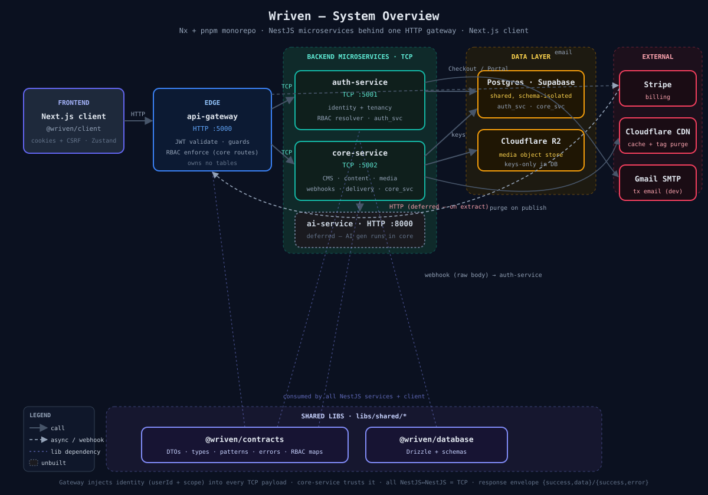

# 00 — System Overview

Wriven at a glance: one HTTP edge, three NestJS microservices behind it (TCP), a Next.js client, a Python/FastAPI `ai-service` (HTTP), and the external providers they depend on. AI generation runs in `ai-service`; core-service calls it over HTTP (the only NestJS↔non-NestJS hop).

## Architecture

> Source: [`00-system-overview.svg`](./00-system-overview.svg) (hand-written SVG; edit directly).

## Protocols & ports

| Link | Protocol | Note |
|------|----------|------|
| client → gateway | HTTP | cookie-based auth (httpOnly access+refresh, in-memory CSRF double-submit) |
| gateway → auth-service | **TCP** | NestJS microservice; `@wriven/contracts` message patterns |
| gateway → core-service | **TCP** | same |
| core-service → ai-service | **HTTP** | the **only** NestJS↔non-NestJS hop; `core.ai.generate` → `POST /generate` (`X-Internal-Secret` auth). Prompt build + `select` retry live in ai-service; quota/audit in core. |
| Stripe → gateway | HTTP POST | `/webhooks/stripe` (raw body, forwards to auth-service) |

## Who owns what

| Layer | Owns | Does NOT |
|-------|------|----------|
| **api-gateway** | HTTP edge, JWT validation, workspace/project membership validation, RBAC enforcement for **core** routes | any tables |
| **auth-service** | `auth_svc` (users, workspaces, projects, members, invitations, sessions, tokens, subscriptions), the RBAC resolver | HTTP surface |
| **core-service** | `core_svc` (content types, entries, media assets, api keys, webhooks) | authZ — trusts gateway-injected identity |
| **ai-service** | AI content generation (prompt build, temperature, `select` retry) | any tables (stateless LLM proxy; quota/audit stay in core) |
| **client** | UI, state, cookie handling | backend secrets |

## Hard rules this diagram encodes

- **Single shared Postgres**, isolated by schema (`auth_svc`, `core_svc`). Gateway + ai-service own **no** tables.
- **Gateway injects identity** — after JWT validation it puts `userId` + scope into every TCP payload; downstream services trust it (core-service never re-validates).
- **R2 keys only** — DB stores object **keys**, never full URLs; URLs reconstructed at runtime.
- **All response envelope** — `{ success, data }` / `{ success, error }`; denials → `FORBIDDEN`.

## Deploy (current vs target)

- **Now:** all local. Supabase (Postgres) + Cloudflare R2 provisioned; client runs on Vercel in prod target.
- **Target:** client → Vercel; gateway + auth + core (+ ai) → VPS in Docker. Not yet shipped (see [doc/market-readiness.md](../market-readiness.md) P0).

## Next diagrams

- [01-auth-rbac.md](./01-auth-rbac.md) — auth + RBAC request flow, permission cascade, enforcement layers
- [02-tenancy-data-model.md](./02-tenancy-data-model.md) — users → workspaces → projects → members
