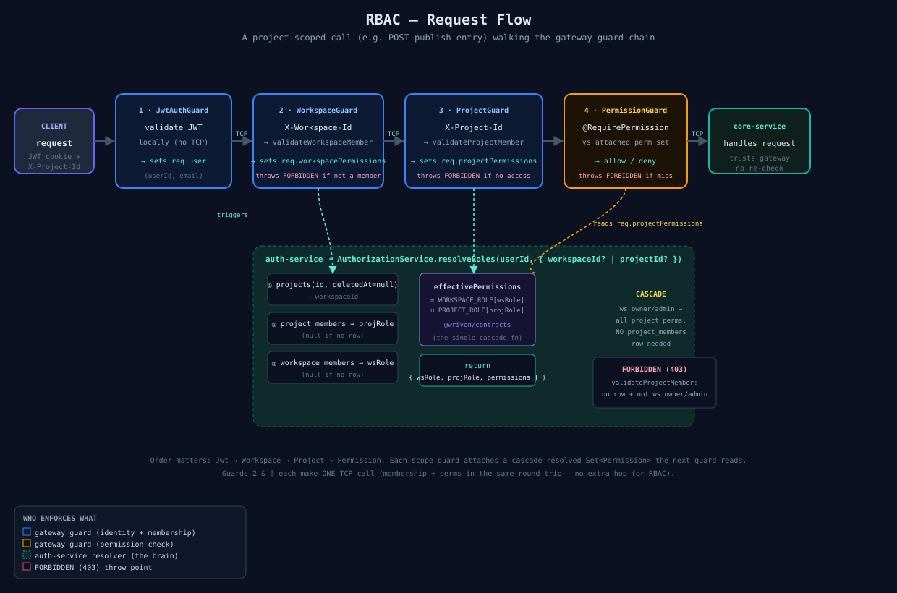
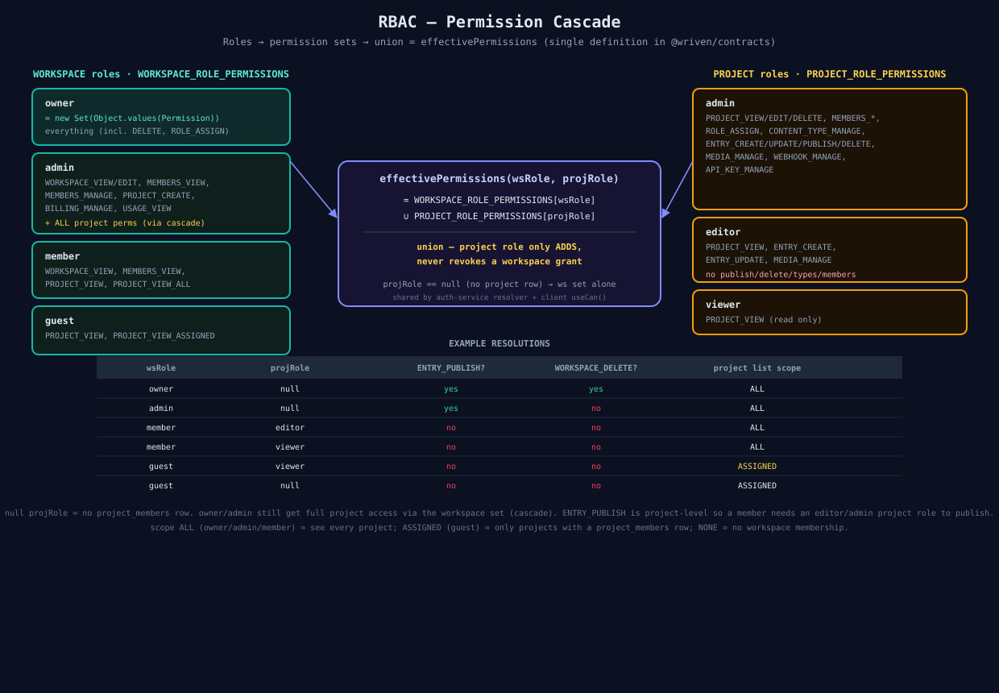
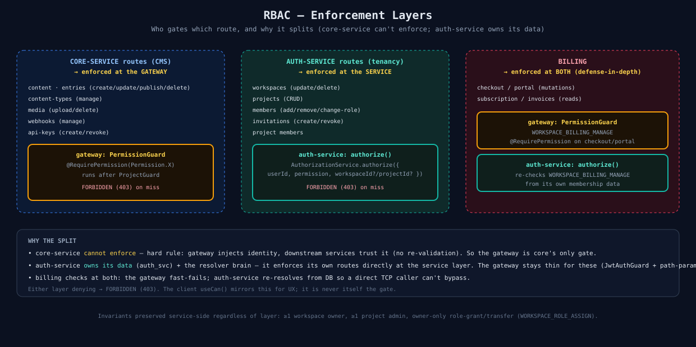

# 01 — Auth & RBAC

How identity, membership, and permissions flow through Wriven. Three diagrams: the request flow, the permission cascade, and the enforcement layers.

## A. Request flow — a project-scoped call walking the guard chain

A request like "publish an entry" passes through four gateway guards in order. Each scope guard makes **one TCP call** to auth-service that returns membership **and** the cascade-resolved permission set — RBAC adds no extra hop. The `PermissionGuard` then checks `@RequirePermission(...)` against whichever set the last scope guard attached. `auth-service.AuthorizationService.resolveRoles` is the brain: it walks project → workspace, reads both membership rows, and unions them via `effectivePermissions` (the one cascade definition, shared with the client `useCan()`).

Key points:
- **Order is fixed:** Jwt → Workspace → Project → Permission. A guard reads what the previous one attached.
- **Cascade is auth-service-side** — a workspace owner/admin with no `project_members` row still resolves every project permission, so the gateway needs no bypass.
- **FORBIDDEN (403)** can be thrown by any guard or by auth-service; the `AllExceptionsFilter` maps it to `{ success:false, error }`.

## B. Permission cascade — roles → effective set

`effectivePermissions(wsRole, projRole)` = `WORKSPACE_ROLE_PERMISSIONS[wsRole] ∪ PROJECT_ROLE_PERMISSIONS[projRole]`. The union only **adds** — a project role never revokes an inherited workspace grant. `projRole == null` (no project row) is valid and means the workspace set stands alone (owner/admin get full project access this way).

- **owner** = every permission (including `WORKSPACE_DELETE`, `WORKSPACE_ROLE_ASSIGN`).
- **admin** = workspace management + all project perms via cascade, but **no** delete/owner-grant.
- **member** = see all projects (scope `ALL`), act only with an explicit project role.
- **guest** = see only assigned projects (scope `ASSIGNED`), auto-seated via a project invite.
- Project **editor** can create/edit + media but not publish/delete/manage; **viewer** is read-only.

## C. Enforcement layers — who gates which route

Enforcement splits by which service owns the data:
- **Core-service (CMS) routes** → gateway `PermissionGuard` (core can't enforce — it trusts gateway-injected identity).
- **Auth-service (tenancy) routes** (workspaces/projects/members/invitations) → service-layer `authorize()` (auth-service owns its data + the resolver).
- **Billing** → both (gateway fast-fails, auth-service re-resolves from DB).

Either layer denying → `FORBIDDEN`. Invariants (≥1 owner, ≥1 admin, owner-only grant) are preserved service-side regardless of layer.

## Mental model (one line)

> Roles live on membership rows; `effectivePermissions` turns them into a set; the gateway checks that set for CMS routes, auth-service checks it for its own routes; the client `useCan()` mirrors it for UX only.

## Source files

- [`01a-rbac-request-flow.svg`](./01a-rbac-request-flow.svg)
- [`01b-permission-cascade.svg`](./01b-permission-cascade.svg)
- [`01c-enforcement-layers.svg`](./01c-enforcement-layers.svg)

## Related

- Spec: [`specs/12-rbac-permissions.md`](../../specs/12-rbac-permissions.md) · Plan: [`plans/05-rbac-permissions.md`](../../plans/05-rbac-permissions.md)
- Code: [`authorization.service.ts`](../../apps/auth-service/src/auth/authorization.service.ts) · [`permission.guard.ts`](../../apps/api-gateway/src/auth/permission.guard.ts) · [`rbac.types.ts`](../../libs/shared/contracts/src/lib/types/rbac.types.ts)
