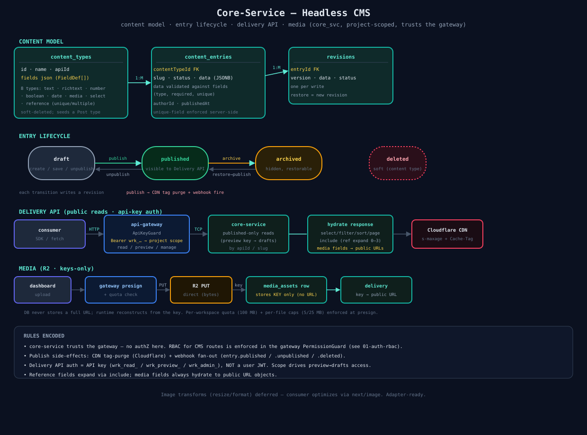

# 04 — Core-Service (Headless CMS)

The CMS engine: content modeling, entry lifecycle, the public Delivery API, and media. `core_svc`, project-scoped, **trusts the gateway** (no authZ here).

## Content model
- **content_types** — user-defined schema: `fields` is a `FieldDef[]` JSONB (8 types incl. `reference` + `media`, with `unique`/`multiple` toggles). Soft-deleted; a `Post` type is seeded per project.
- **content_entries** — instances. `data` JSONB validated against the type's fields (type/required/unique). `slug`, `status`, `authorId`, `publishedAt`. Unique-field enforcement server-side.
- **revisions** — one per write; restore records a new revision.

## Entry lifecycle
`draft → published → archived` (+ soft delete). Each transition writes a revision. **Publish** is the side-effect hub: CDN tag-purge + webhook fan-out (`entry.published`/`unpublished`/`deleted`). Only `published` entries are visible to the Delivery API.

## Delivery API (public reads)
- Auth = **API key** (`wrk_read_` / `wrk_preview_` / `wrk_admin_`), not a user JWT. `ApiKeyGuard` resolves project scope; key scope drives `preview`→drafts.
- Published-only reads by `apiId`/slug; `select`/`filter`/`sort`/`paginate`; `include` expands references (depth 0–3); media fields always hydrate to public URL objects.
- Responses carry `s-maxage` + `Cache-Tag` for Cloudflare; publish triggers a tag purge.

## Media (R2, keys-only)
Presign → direct PUT to R2 → persist the object **key** (never a URL) in `media_assets` → delivery reconstructs the public URL at read. Per-workspace quota (100 MB) + per-file caps enforced at presign.

## Usage metering (specs/14)
`usage_buckets` — one row per workspace × calendar month (UTC), `request_count` bigint atomically incremented (`ON CONFLICT … + n`). The gateway counts each Delivery request in-process and flushes a batch every ~15s (`core.usage.record`); it never blocks the hot path. `core.usage.read` composes the current-period `UsageView` = request count + live `media_assets` byte SUM + effective plan limits (via `CoreEntitlementsService`, cached + fail-open). Surfaced at `GET /usage` + the dashboard Usage page. Soft overage gate (`USAGE_ENFORCE`, default off) → `RATE_LIMITED` 429. `assetBandwidthGb` is **not** metered (R2 keys-only — egress lives in R2).

## Source
[`04-core-cms.svg`](./04-core-cms.svg) · code: [`apps/core-service/src/`](../../apps/core-service/src/)
