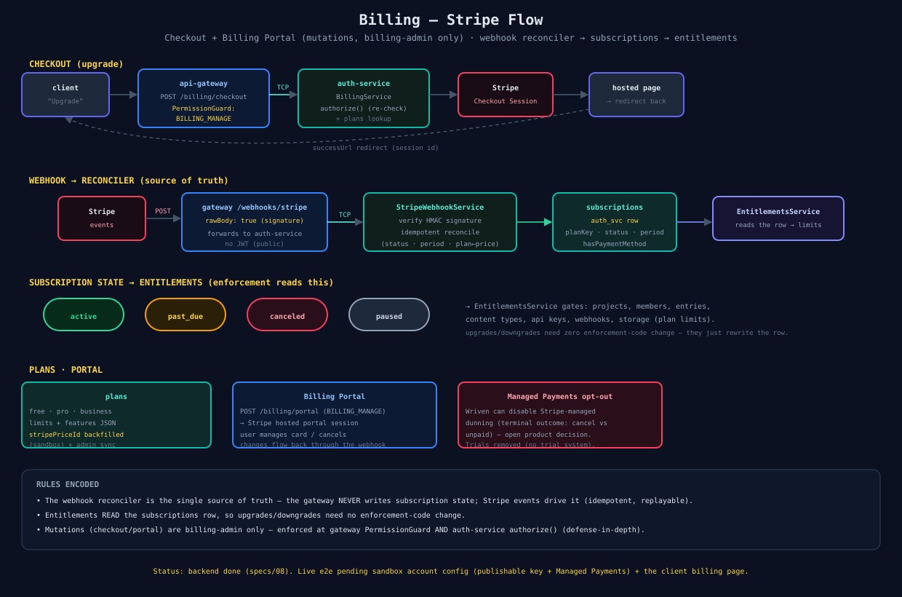

# 05 — Billing (Stripe)

Payments lifecycle: Checkout + Billing Portal for mutations, the webhook reconciler as source of truth, and entitlements that read off the `subscriptions` row.

## Checkout (upgrade)
client → `POST /billing/checkout` (gateway `PermissionGuard` = `WORKSPACE_BILLING_MANAGE`) → auth-service `BillingService` (re-`authorize()`) → Stripe Checkout Session → redirect to hosted page → back to `successUrl`. Portal is the same shape for managing an existing subscription.

## Webhook → reconciler (source of truth)
Stripe events → `POST /webhooks/stripe` (gateway, `rawBody: true`, **no JWT** — public) → auth-service `StripeWebhookService` verifies the HMAC signature and **idempotently** reconciles the `subscriptions` row (status, period, plan-from-price-id). The gateway never writes subscription state — Stripe events drive it. An event-replay script exists for recovery.

## Entitlements
`EntitlementsService` **reads** the `subscriptions` row → enforces plan limits (projects, members, entries, content types, api keys, webhooks, storage). Because enforcement reads the row, upgrades/downgrades need **zero** code changes — the reconciler rewrites the row.

## Usage metering (specs/14)
Limits like `apiRequestsPerMonth` / `storageMb` are advertised by the plan but only bite once **measured**. core-service owns the counter (`usage_buckets`) + composes a `UsageView` (requests used + storage SUM + the limits above); the gateway batches Delivery-request increments off the hot path. Read at `GET /usage` + shown on the dashboard Usage page. Soft overage gate (`USAGE_ENFORCE`, default off). See [diagram 09](./09-usage-metering.md). `assetBandwidthGb` stays unmeasured for now.

## Plans + status
- `plans` (free/pro/business): limits + features JSON; `stripePriceId` backfilled on the sandbox (+ admin sync).
- Subscription states: `active / past_due / canceled / paused / incomplete`.
- Trials removed (no trial system). Managed Payments dunning outcome (cancel vs `unpaid`) is an open product decision.

## Status
Backend done ([specs/08](../../specs/08-stripe-billing.md)). Live e2e pending sandbox account config (publishable key + Managed Payments) + the client billing page.

## Source
[`05-billing.svg`](./05-billing.svg) · code: [`apps/auth-service/src/billing/`](../../apps/auth-service/src/billing/)
