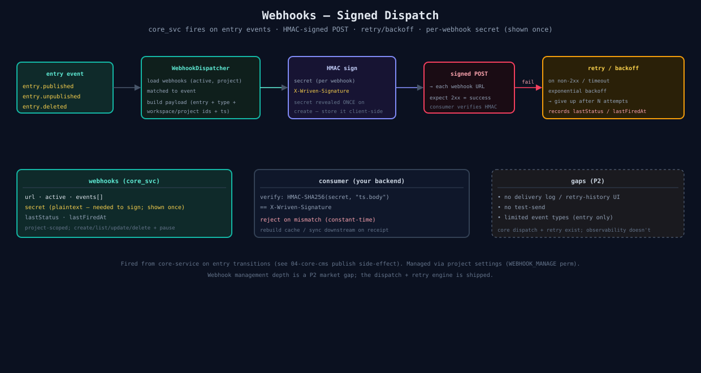

# 06 — Webhooks

core_svc fires signed HTTP POSTs on entry events; consumers verify the HMAC signature.

## Dispatch
1. Entry event (`entry.published` / `unpublished` / `deleted`) → `WebhookDispatcher`. `entry.published` fires on the first publish transition **and again on every save of an already-published entry** (including slug renames) — consumers must be idempotent.
2. Loads active webhooks for the project whose `events[]` match.
3. Builds payload (entry + type + workspace/project ids + timestamp).
4. **HMAC-signs** with the webhook's per-secret → `X-Wriven-Signature`.
5. POST to each URL; 2xx = success, else retry with **fixed backoff `[500, 2000]` ms — 3 attempts total, 10s timeout per attempt**.
6. Records `lastStatus` / `lastFiredAt`.

## Secrets
Per-webhook secret; **plaintext revealed exactly once** on create (store it). Hashed at rest. Consumer verifies with two headers — `X-Wriven-Timestamp: <firedAt>` and `X-Wriven-Signature: sha256=<hex>` — where the MAC is `HMAC-SHA256(secret, "<firedAt>.<rawBody>")` (timestamp-prefixed body, constant-time compare). `@wriven-ai/next`'s `verifyWrivenSignature` implements this scheme.

## Gaps (P2)
Delivery log / retry-history UI, test-send, more event types — not built. Dispatch + retry engine is shipped; observability isn't.

## Source
[`06-webhooks.svg`](./06-webhooks.svg) · code: [`apps/core-service/src/`](../../apps/core-service/src/) · UI: [`webhooks-section.tsx`](../../apps/client/src/components/webhooks/webhooks-section.tsx)
