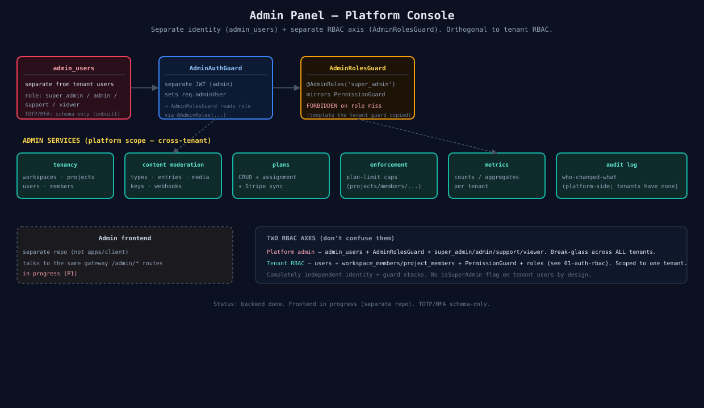

# 07 — Admin Panel (Platform Console)

The operational console for Wriven staff — cross-tenant. **Separate identity and a separate RBAC axis** from tenant RBAC.

## Identity + guards
- **admin_users** — distinct from tenant `users`. Roles: `admin / moderator / member`.
- **AdminJwtGuard** — verifies the admin JWT locally (`ADMIN_JWT_SECRET`, signed by auth-service) → sets `req.adminUser`.
- **AdminRolesGuard** + `@AdminRoles(...)` — mirrors the tenant `PermissionGuard` (which copied *its* pattern). FORBIDDEN on role miss.

## Services (platform scope, cross-tenant)
tenancy moderation · content/media/key/webhook moderation · **support-ticket queue** (assignment, priority, staff replies + internal notes, ticket metrics) · plans CRUD + assignment (+ Stripe sync) · plan-limit enforcement · metrics · **audit log** (platform-side; tenants have their own activity feed since [specs/23](../../specs/23-workspace-activity-logs.md) — same interceptor pattern, separate table).

## Frontend
Separate repo (not `apps/client`), talks to the same gateway `/admin/*` routes — **deployed at `admin.wriven.tech`** with all console sections functional.

## The two RBAC axes (don't confuse them)
| | Platform admin | Tenant RBAC |
|---|---|---|
| Identity | `admin_users` | `users` |
| Guard | `AdminRolesGuard` | `PermissionGuard` |
| Roles | admin/moderator/member | owner/admin/member/guest + project admin/editor/viewer |
| Scope | all tenants | one tenant |
| Stack | fully independent | fully independent |

No `isSuperAdmin` flag on tenant users — by design.

## Source
[`07-admin-panel.svg`](./07-admin-panel.svg) · code: [`apps/*/src/admin/`](../../apps/api-gateway/src/admin/)
