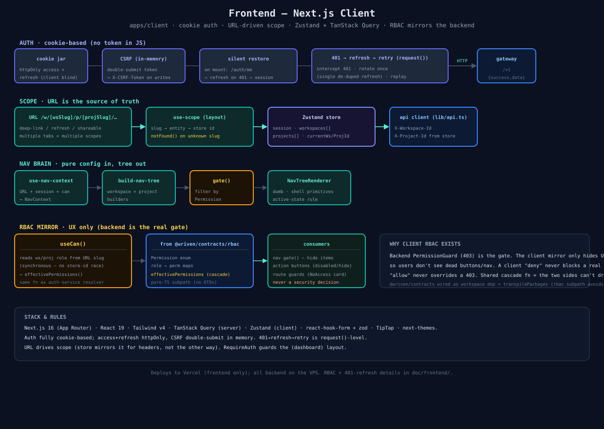

# 08 — Frontend (Next.js Client)

`apps/client` — how the dashboard works: cookie auth, URL-driven scope, the nav brain, and the client-side RBAC mirror.

## Auth (cookie-based, no token in JS)
- httpOnly **access + refresh** cookies the client never reads; **CSRF** double-submit token held in memory, echoed as `X-CSRF-Token` on writes.
- **Silent restore** on mount: `/auth/me`; on 401, rotate once (single de-duped refresh) and replay the original request.

## Scope — URL is the source of truth
`/w/[wsSlug]/p/[projSlug]/…` resolves the active workspace/project. `use-scope` mirrors slug → store id (for the API client's `X-Workspace-Id` / `X-Project-Id` headers); the store never *drives* scope. Multiple tabs hold different scopes.

## Nav brain
`use-nav-context` (URL + session + `can`) → `build-nav-tree` (pure) → `gate()` filters by `Permission` → `NavTreeRenderer` (dumb shell primitives). Adding a menu item = one builder entry; zero renderer changes.

## RBAC mirror (UX only)
`useCan()` reads the ws/proj role from the **URL slug** (synchronous — no store-id race), runs the shared `effectivePermissions()` from `@wriven/contracts/rbac`, and returns `can(permission) => boolean`. Consumers: nav `gate()` (hide items), action buttons (disable/hide), route guards (`NoAccess` card). **Never a security decision** — the backend `PermissionGuard` (403) is the gate; the client only hides UI you can't use. Contracts wired via `workspace:*` dep + `transpilePackages`, imported through the pure `./rbac` subpath so NestJS/class-validator DTOs stay out of the client bundle.

## Stack
Next.js 16 (App Router) · React 19 · Tailwind v4 · TanStack Query · Zustand · react-hook-form + zod · TipTap · next-themes. `RequireAuth` guards the `(dashboard)` layout. Deploys to Vercel (frontend only).

## Source
[`08-frontend.svg`](./08-frontend.svg) · code: [`apps/client/src/`](../../apps/client/src/) · docs: [`doc/frontend/`](../frontend/)
