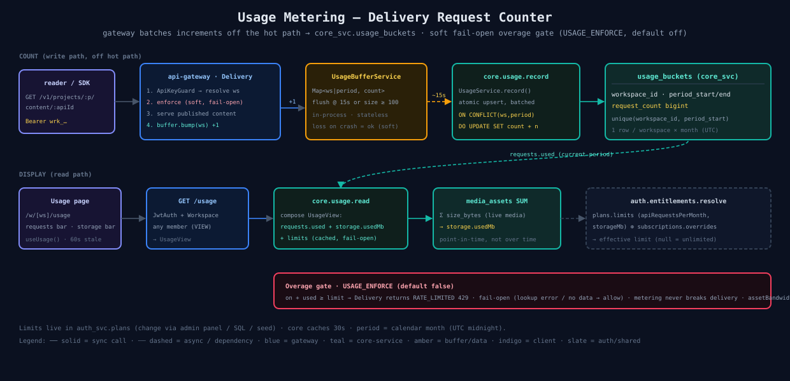

# 09 — Usage Metering

Plans advertise `apiRequestsPerMonth` / `storageMb` but those only bite once **measured**. This is the metering layer: count Delivery API requests per workspace per month, store them, read them back, and (optionally, softly) block on overage. `core_svc` owns the counter; limits stay in `auth_svc`. See [specs/14](../../specs/14-usage-metering.md).

## Count (write path — off the hot path)
- Reader hits the Delivery API with a `Bearer wrk_…` key. `ApiKeyGuard` resolves the workspace.
- Gateway: soft **enforce** check → **serve** published content → `buffer.bump(ws) +1` (in-process `Map`, keyed by `workspace|period` so a flush straddling month-end attributes correctly).
- `UsageBufferService` flushes every ~15s (or at size ≥ 100) → `core.usage.record` (fire-and-forget; loss on crash is acceptable — metering is soft).
- `UsageService.record` does the atomic upsert: `INSERT … ON CONFLICT (workspace_id, period_start) DO UPDATE SET request_count + n`.

## Display (read path)
- `GET /usage` (any workspace member) → gateway → `core.usage.read`.
- `UsageService.read` composes the `UsageView`:
  - **requests.used** ← `usage_buckets.request_count` for the current period.
  - **storage.usedMb** ← live `Σ media_assets.size_bytes` (point-in-time, not metered over time).
  - **ai** ← `AiUsageStats` from `ai_generations` (specs/21): `requests.used` (succeeded), `tokens` + `cost` (succeeded **and** failed), `cost.complete` honesty flag.
  - **limits** ← `auth.entitlements.resolve` (`plans.limits ⊕ subscriptions.overrides`), cached 30s + fail-open.
- Period = calendar month, UTC midnight boundaries. The dashboard Usage page (`/w/[ws]/usage`) renders the two bars.

## Overage gate (off by default)
`USAGE_ENFORCE=true` + `requests.used ≥ limit` → Delivery returns `RATE_LIMITED` 429. **Fail-open**: a lookup error or missing data allows the request — metering never breaks delivery. The counter is batched, so the gate lags real usage by one flush. Ship meter+display first; flip enforcement on only after staging validates the counts.

## Not metered
- **`assetBandwidthGb`** — media is R2 keys-only, so the gateway never serves asset bytes; real egress lives in R2. Deferred until an R2/egress integration. The field stays in `PlanLimits` for future use.

## Status
Counting + read API + dashboard page shipped (specs/14). Enforcement built but default-off pending live validation.

## Source
[`09-usage-metering.svg`](./09-usage-metering.svg) · code: [`apps/core-service/src/usage/`](../../apps/core-service/src/usage/) · [`apps/api-gateway/src/usage/`](../../apps/api-gateway/src/usage/)
