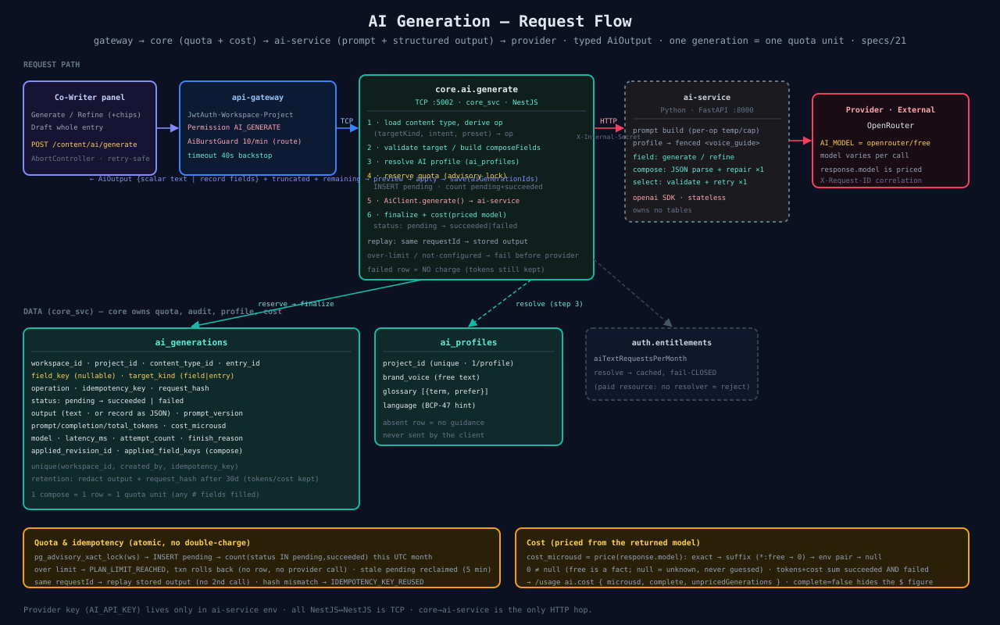

# 10 — AI Generation (Flow)

A generation is a **draft until applied** — the author previews, then explicitly applies it through the normal entry-save path; AI never publishes. The request fans out across three services: the gateway enforces auth/permission/burst, **core-service** owns everything DB-bound (quota, audit, per-project voice, cost), and the standalone **Python ai-service** owns the prompt and the provider call. core→ai-service is the **only NestJS↔non-NestJS HTTP hop**; everything else is TCP. See [specs/21](../../specs/21-ai-generation-redesign.md).

## Request path (happy path)
- Client `POST /content/ai/generate` with an `AbortController` and a browser-generated `requestId` (the idempotency intent).
- **Gateway** — `JwtAuth · Workspace · Project · Permission(AI_GENERATE)`, the per-route `AiBurstGuard` (~10/min/workspace), and a **40s timeout** backstop so a wedged downstream can't pin a worker.
- **core.ai.generate** runs six steps in order:
  1. load the content type + **derive the operation** from `(targetKind, intent, preset)`.
  2. validate the target (Tier-1, single-value, not sensitive) or assemble `composeFields` for a whole-entry draft.
  3. **resolve the AI profile** (`ai_profiles`) — brand voice / glossary / language.
  4. **reserve quota** under a per-workspace advisory lock.
  5. call the injected `AiClient` → ai-service over HTTP (`X-Internal-Secret`).
  6. **finalize** the audit row (`succeeded`/`failed`) + compute cost from the returned model.
- **ai-service** (FastAPI, stateless, owns no tables) builds the prompt (per-operation temperature/token-cap, profile as a fenced `<voice_guide>`), calls the provider via the `openai` SDK, and validates/repairs structured output.

## Quota & idempotency (no double-charge)
`reserveQuota` runs in one transaction: `pg_advisory_xact_lock(workspace)` → reclaim stale `pending` rows (5 min) → `INSERT pending` → `count(status IN ('pending','succeeded'))` this **UTC month**. Over limit → `PLAN_LIMIT_REACHED`, the transaction rolls back (no row, **no provider call**). The same `requestId` replays the stored output without a second call; a hash mismatch → `IDEMPOTENCY_KEY_REUSED`. A **failed** provider call records its tokens on the `failed` row but counts toward **no** request quota.

## Cost (priced from the returned model)
`openrouter/free` resolves to a different model per call, so cost is keyed on `response.model`, not the requested `AI_MODEL`: exact → suffix (`*:free → 0`) → env pair → `null`. `0` ≠ `null` (free is a fact; null means unknown, **never guessed**). Tokens and cost sum `succeeded` **and** `failed`; the billable request count is `succeeded` only. Surfaced on `/usage` as `ai.cost { microusd, complete, unpricedGenerations }` — `complete:false` hides the dollar figure.

## What's stored
One `ai_generations` row per intent — **one compose = one row = one quota unit**, regardless of how many fields it fills. `target_kind` (`field`|`entry`), nullable `field_key`, typed `output` (text or record-as-JSON), token totals, `cost_microusd`, and `applied_field_keys` (compose provenance). Retention redacts `output` + `request_hash` after `AI_AUDIT_RETENTION_DAYS` (30d) but **keeps** tokens/cost/model for financial audit.

## Not in this path
- **Streaming** (browser SSE) — deferred; the TCP hop can't carry a stream today.
- **Async jobs** (bulk / translate-all / image) — `ai_generations` is already the durable hand-off record; a queue is additive.
- **Embeddings / RAG** — no vector store yet.

## Source
[`10-ai-generation-flow.svg`](./10-ai-generation-flow.svg) · [`11-ai-output-model.svg`](./11-ai-output-model.svg) · code: [`apps/core-service/src/ai/`](../../apps/core-service/src/ai/) · [`apps/ai-service/app/`](../../apps/ai-service/app/) · [`apps/api-gateway/src/content/ai.controller.ts`](../../apps/api-gateway/src/content/ai.controller.ts)
