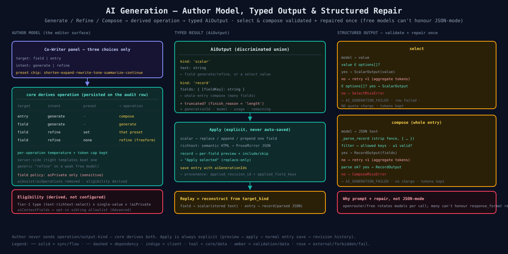

# 11 — AI Output Model & Structured Repair

The author surface is intentionally tiny — three choices — and the server derives everything else. The result is a **typed `AiOutput`** so one generation can fill a field or a whole entry. The two structured paths (`select`, `compose`) are validated and **repaired once** on free models that can't honour JSON-mode reliably. See [specs/21](../../specs/21-ai-generation-redesign.md).

## Author model → operation
The editor offers a **target** (`field` | `entry`), an **intent** (`generate` | `refine`), and an optional **preset chip**. core derives the persisted operation:

| target | intent | preset | → operation |
|---|---|---|---|
| entry | generate | — | `compose` |
| field | generate | — | `generate` |
| field | refine | set | that preset (expand·shorten·rewrite·tone·summarize·continue) |
| field | refine | none | `refine` (freeform instruction) |

The 9 operations stay server-side because on a weak free model a **tight per-verb template + specific temperature/token-cap** beats one generic "refine" prompt. The UI collapse is presentational only. `tone` has no dedicated input — the author's `instruction` carries the target tone.

## Field policy (derived, not configured)
The old `aiAssist` (enable) and `aiOperations` (action allowlist) are **gone**. The only per-field control is **`aiPrivate`** (sensitive — never a target or context). Eligibility is derived: Tier-1 type (text · richtext · select) ∧ single-value ∧ not sensitive. `aiContextFields` is an opt-in sibling allowlist under Advanced.

## Typed result — `AiOutput`
- `{ kind: 'scalar', text }` — one field (generate/refine, or a validated select value).
- `{ kind: 'record', fields: { [fieldKey]: string } }` — a whole-entry `compose`.

`truncated?` is set when `finish_reason === 'length'` so the author is told the output is partial. Replay reconstructs the typed output from the row's `target_kind` (field → scalar text; entry → parsed JSON).

## Apply (explicit, never auto-saved)
- **scalar** → replace / append / prepend the field; richtext converts semantic HTML → ProseMirror JSON.
- **record** → per-field preview with include/skip checkboxes → "Apply selected" (replace-only).
- Saving the entry with `aiGenerationIds` records provenance: `applied_revision_id` (+ `applied_field_keys` for a compose, the generated record's keys).

## Structured output — validate + repair once
Both structured paths use **prompt + validate + one repair**, never a provider `response_format` (free models rotate and can't honour it reliably):

- **select** — value must be ∈ `options[]`; on a miss, retry once (aggregating tokens); a second miss → `SelectMissError` → `AI_GENERATION_FAILED`, row `failed`, **no quota charge**, tokens kept.
- **compose** — `_parse_record` strips a stray code fence, extracts `{ … }`, filters to allowed keys, requires ≥1 valid field; same retry-once-then-fail contract → `ComposeMissError`.

A failed structured turn still burned tokens (provider was called), which is exactly why token/cost sums include `failed` rows while the request quota does not.

## Source
[`11-ai-output-model.svg`](./11-ai-output-model.svg) · [`10-ai-generation-flow.svg`](./10-ai-generation-flow.md) · code: [`apps/ai-service/app/generator.py`](../../apps/ai-service/app/generator.py) · [`apps/ai-service/app/prompts.py`](../../apps/ai-service/app/prompts.py) · [`libs/shared/contracts/src/lib/dto/ai.dto.ts`](../../libs/shared/contracts/src/lib/dto/ai.dto.ts)
